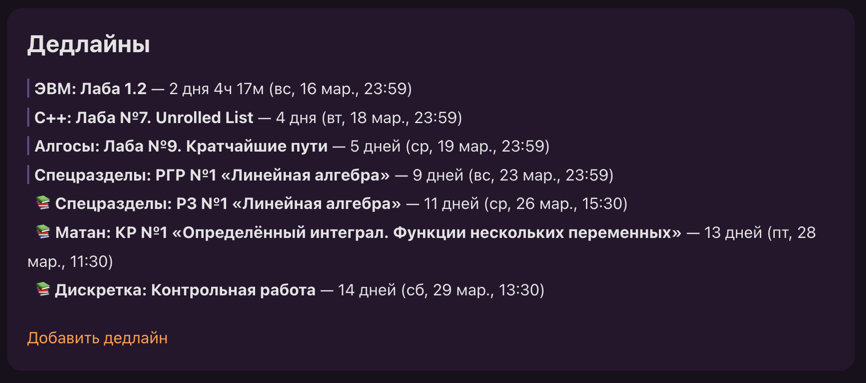
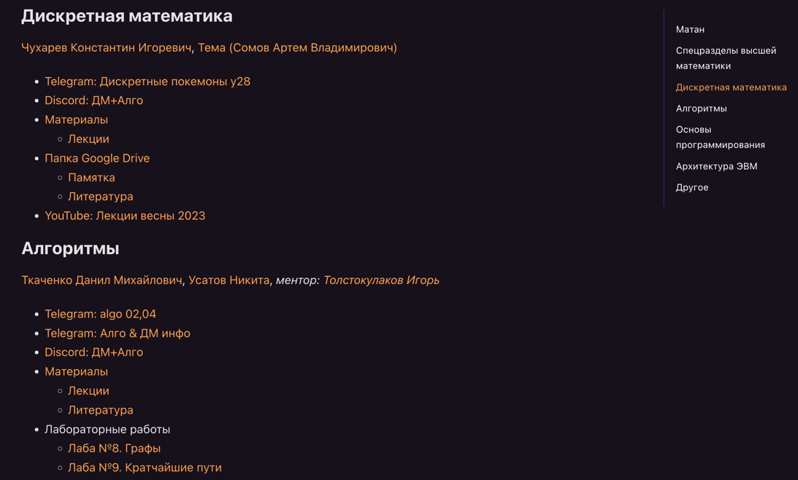
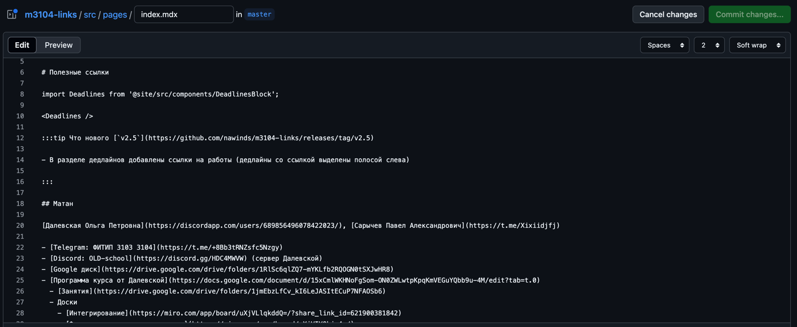
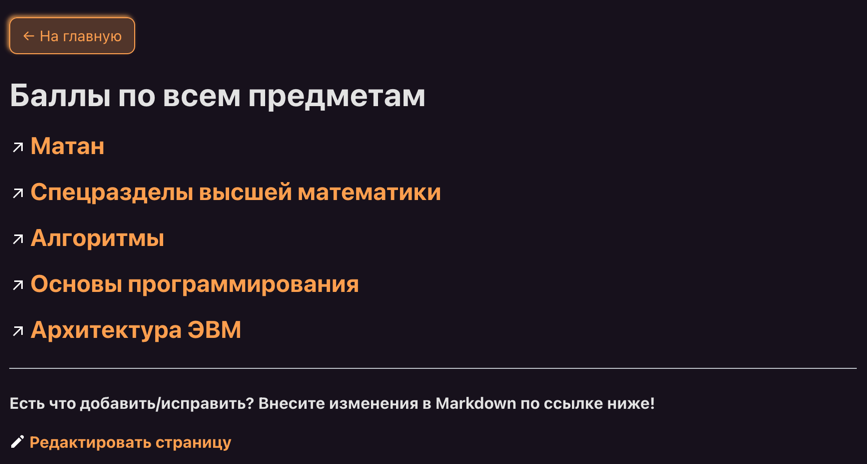
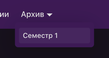
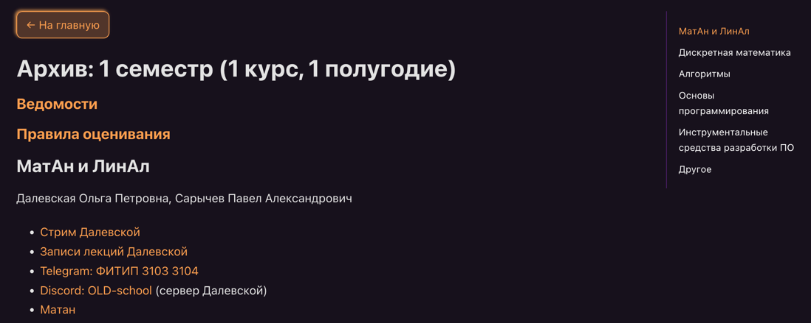
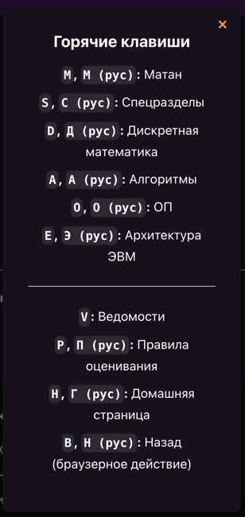
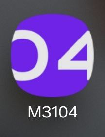
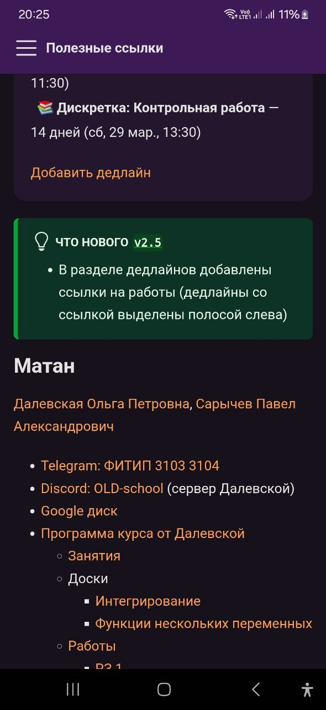
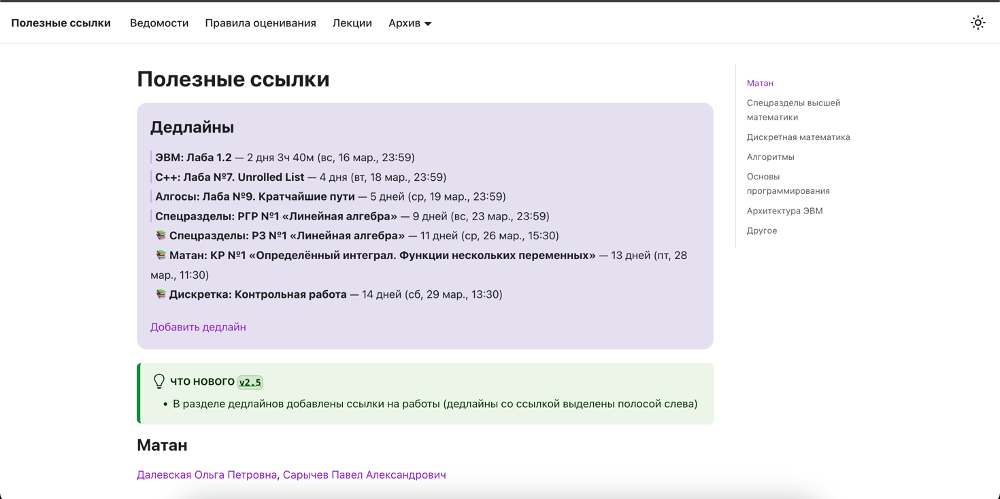

# Сайт полезных ссылок группы M3104 Университета ИТМО — [M3104.nawinds.dev](https://m3104.nawinds.dev)

### Useful links website for M3104 group @ ITMO University — [M3104.nawinds.dev](https://m3104.nawinds.dev)

---

Этот сайт работает на базе проекта [Docusaurus](https://docusaurus.io/), что позволяет легко редактировать его содержимое прямо на GitHub в Markdown и хостить его с помощью GitHub Actions.

1. [Хотите своей группе такой же сайт?](#хотите-своей-группе-такой-же-сайт)
2. [Установка / Installation](#установка--installation)
3. [Локальная разработка / Local Development](#локальная-разработка--local-development)
4. [Сборка / Build](#сборка--build)
5. [Развертывание / Deployment](#развертывание--deployment)
6. [Редактирование сайта](#редактирование-сайта)
   - [Редактирование главной страницы](#редактирование-главной-страницы)
   - [Редактирование дедлайнов](#редактирование-дедлайнов)
   - [Редактирование меню и подвала сайта](#редактирование-меню-и-подвала-сайта)
   - [Редактирование номера группы и информации о сайте](#редактирование-номера-группы-и-информации-о-сайте)
   - [Другие вопросы по настройке сайта](#другие-вопросы-по-настройке-сайта)
7. [Фичи / Features](#фичи--features):
    - [Блок дедлайнов / Deadlines block](#блок-дедлайнов--deadlines-block)
    - [Разделение на предметы / Division into subjects](#разделение-на-предметы--division-into-subjects)
    - [Удобное редактирование контента в Markdown / Easy editing in Markdown](#удобное-редактирование-контента-в-markdown--easy-editing-in-markdown)
    - [Страница ведомостей / Grades table page](#страница-ведомостей--grades-table-page)
    - [Архив ссылок по семестрам / Links archive by semester](#архив-ссылок-по-семестрам--links-archive-by-semester)
    - [Горячие клавиши / Shortcuts](#горячие-клавиши--shortcuts)
    - [Веб-приложение / PWA (Web app)](#веб-приложение--pwa-web-app)
    - [Светлая и темная тема / Light & dark color theme](#светлая-и-темная-тема--light--dark-color-theme)
8. [Поддержать проект](#поддержать-проект)

## Хотите своей группе такой же сайт?

**Пишите [мне](https://t.me/nawinds)!** Вам понадобится всего лишь сделать форк репозитория, чтобы запустить такой же сайт, а я могу выделить для вашей группы субдомен и направить его на ваш репозиторий. Вы получите возможность быстро и легко вставлять на сайт ссылки для своей группы и актуальные дедлайны. Если возникнут вопросы о том, как и где это делать, с удовольствием отвечу!

### Установка / Installation

```
$ yarn
```

### Локальная разработка / Local Development

```
$ yarn start
```

Эта команда запускает локальный сервер разработки и открывает окно браузера. Большинство изменение применяются в реальном времени без необходимости перезапускать сервер.

This command starts a local development server and opens up a browser window. Most changes are reflected live without having to restart the server.

### Сборка / Build

```
$ yarn build
```
Эта команда генерирует статический контент в папке `build`, который может быть размещен с помощью любого сервера статического контента.

This command generates static content into the `build` directory and can be served using any static contents hosting service.

### Развертывание / Deployment

Используя SSH:

Using SSH:

```
$ USE_SSH=true yarn deploy
```

Не используя SSH:

Not using SSH:

```
$ GIT_USER=<Your GitHub username> yarn deploy
```

Если Вы используете GitHub Pages для хостинга, эта команда является удобным способом собрать сайт и запушить его в ветку `gh-pages`.

If you are using GitHub Pages for hosting, this command is a convenient way to build the website and push to the `gh-pages` branch.


### Редактирование сайта

#### Редактирование главной страницы

Основное содержимое страниц сайта хранится в виде Markdown файлов в директории [/src/pages](src/pages/).
Для редактирования главной страницы, отредактируйте файл [/src/pages/index.md](src/pages/index.mdx). Остальные файлы 
называются в соответствии с их путями на сайте.

#### Редактирование дедлайнов

Дедлайны хранятся в формате JSON в файле [/static/DEADLINES.json](static/DEADLINES.json). Поля `name` и `time` являются обязательными для заполнения у каждого дедлайна, `url` не обязательно, но в него удобно записывать ссылки на дедлайны (то есть на сами лабы, например). Если Вы не хотите указывать `url`, то нужно вообще убрать поле `url` из соответствующего дедлайна.

Чтобы добавить не обычный дедлайн, а тест (или, например, контрольную, теормин и т.д.), в поле `name` перед названием дедлайна напишите `[Тест]`, например, `[Тест] Матан: Контрольная работа по интегрированию`.

#### Редактирование меню и подвала сайта

Содержимое меню и подвала сайта редактируется через файл [docusaurus.config.js](docusaurus.config.js). Просто найдите в этом конфиге `navbar` и `footer`, чтобы добавить или удалить оттуда ссылки.

#### Редактирование номера группы и информации о сайте

1. Измените `title` на номер Вашей группы, `url` на актуальный адрес сайта, `organizationName` и `projectName` на юзернейм владельца репозитория и название репозитория на GitHub в файле [docusaurus.config.js](docusaurus.config.js).
2. Измените номер группы в файле [manifest.json](static/manifest.json).
3. Измените иконки сайта на свои ([favicon.ico](static/favicon.ico), [favicon-32x32.png](static/img/favicon-32x32.png), [android-chrome-192x192.png](static/img/android-chrome-192x192.png), [android-chrome-512x512.png](static/img/android-chrome-512x512.png))
4. Откройте содержимое всех страниц в директории [pages](src/pages), измените номер группы и другую информацию на актуальную в `title` и `description`, измените ссылки на редактирование страницы внизу .mdx файлов.

### Другие вопросы по настройке сайта

Чтобы настроить сайт под себя, вы можете обратиться к документации [Docusaurus](https://docusaurus.io/docs).

### Фичи / Features

#### Блок дедлайнов / Deadlines block



В верхней части главной страницы располагается блок с актуальными дедлайнами. Дедлайны расположены в хронологическом порядке, старые дедлайны не отображаются.

У каждого дедлайна есть ссылка на добавление в Google Календарь (при наведении на дату дедлайна). Кроме того, дедлайны, выделенные вертикальной полосой слева, имеют ссылки на сами лабы/дз/..., которые к ним относятся.

Дедлайны имеют разделение на обычные и на тесты (то есть тесты/контрольные/зачёты/... визуально выделяются значком 📚)

Ещё таймер у каждого дедлайна обновляется каждую минуту без обновления страницы :)

Под дедлайнами расположена ссылка на добавление дедлайна. Ссылка ведет сначала на подробную инструкцию по добавлению дедлайнов.

Дедлайны добавляются в формате JSON в специальный файл на GitHub. Как и при редактировании страниц сайта, достаточно сделать коммит, чтобы дедлайны появились на сайте.

В дополнение к дедлайнам на сайте, существует так же специальный [бот-дедлайнер](https://github.com/nawinds/deadline_bot), который каждый вечер в 17 часов отправляет в группу актуальные дедлайны. Бот берет дедлайны с этого же сайта, что избавляет от необходимости добавлять дедлайны в разные места. Функционал бота почти идентичный блоку дедлайнов на сайте.

#### Разделение на предметы / Division into subjects



Ссылки на сайте разделены на разные предметы для упрощения навигации. В десктопной версии сайта есть быстрая навигация по предметам в правой части сайта, а также поддерживаются [горячие клавиши](#горячие-клавиши--shortcuts).

#### Удобное редактирование контента в Markdown / Easy editing in Markdown



Контент страниц можно быстро изменять в Markdown, делая коммиты на GitHub, после чего изменения отображаются на сайте в течение нескольких минут, что позволяет добавлять нужные ссылки с любого устройства прямо на ходу.

Делать коммиты напрямую может любой пользователь с соответствующими правами в репозитории, а все остальные также могут предложить любые свои правки, сделав форк репозитория и создав pull request.

#### Страница ведомостей / Grades table page



Ссылки на таблицы ведомостей вынесены на отдельную страницу, доступную из меню сайта, делая удобным просмотр всех своих оценок.

Также только на этой странице можно открыть нужную ссылку, используя [горячую клавишу](#горячие-клавиши--shortcuts) нужного предмета.

#### Архив ссылок по семестрам / Links archive by semester

|  |  |
|--------------------------------------------|--------------------------------------------|

Из меню сайта нетрудно найти архив со ссылками за прошлые семестры, что позволяет быстро находить свои старые оценки, работы и лекции.

#### Горячие клавиши / Shortcuts



На всём сайте работают горячие клавиши для быстрой навигации по сайту в десктопной версии. Среди них есть клавиши для перехода на другие страницы сайта и для пролистывания страницы к нужному предмету.

У каждого предмета есть несколько горячих клавиш, семантически привязанных к первой букве в названии предмета и в русской и в английской раскладке. В большинстве случаев активная раскладка на работу горячих клавиш не влияет, что позволяет не тратить время на включение нужной.

#### Веб-приложение / PWA (Web app)

| Иконка приложения                          | Скриншот 1                                               | Скриншот 2                                               |
|--------------------------------------------|----------------------------------------------------------|----------------------------------------------------------|
|  |  |  |

Сайт настроен под использование в качестве веб-приложения (PWA), что позволяет устанавливать его как приложение на мобильных телефонах. Это позволяет получить быстрый доступ к сайту с мобильных устройств.

Для установки веб-приложения, рекомендуется воспользоваться браузером Chrome.

#### Светлая и темная тема / Light & dark color theme

|  |  |
|--------------------------------------------------|----------------------------------------------------|

В ИТМО учится много любителей тёмной темы, а поэтому немаловажной особенностью всего, что разрабатывается для студентов, является наличие тёмной темы, кроме стандартной светлой.

Переключение темы поддерживается на всех версиях сайта.

## Поддержать проект

Поддержите проект, сделав **[перевод на Т-Банк](https://www.tbank.ru/cf/4tI8tyioxMb)** или став моим спонсором на **[GitHub Sponsors](https://github.com/sponsors/nawinds)**!

Собранные средства мотивируют развивать сайт, добавлять новые фичи, а также подумать над созданием других полезных сервисов в рамках ИТМО.
